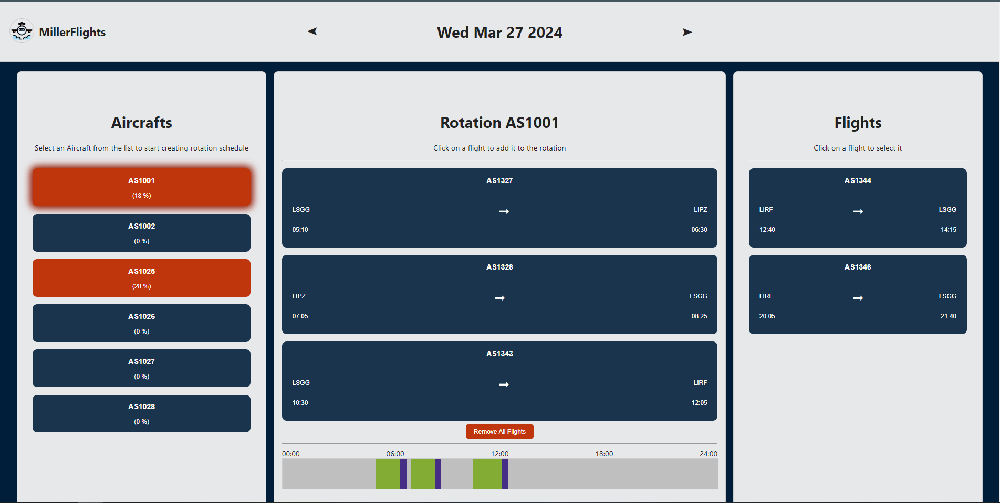

# Aircraft Scheduling App

This project was created using ReactJS.

## Demo

Open [https://nehamiller-aircraft-scheduling.netlify.app/]

## To run this app

In the project directory, you'll need to run:

### `npm install`

followed by 

### `npm start`

Runs the app in the development mode.\
Open [http://localhost:3000](http://localhost:3000) to view it in your browser.

## Problem Statement
The COO of MillerFlights Airline needs an aircraft scheduling tool and these were the requirements prescribed:
1. The app displays a list of MillerFlights aircraft to choose from.
2. The app displays a list of all flights the airline plans to operate that day, their origin, destination, departure time and arrival time.
3. The rotation is the list of flights, in order, an individual aircraft will operate during that day.
4. The app lets the user edit the rotation freely but enforces the following rules:
    - All aircrafts must be on the ground at midnight.
    - The turnaround time is always 20min.
5. The app must display, for each aircraft, its utilization in percent.
6. Display aircraft timeline for the selected aircraft.

## Notes:
1. The Rotation Schedule is being created for tomorrow.
2. The first step is to select Aircraft. If you click on a flight before selecting an aircraft, an error message is shown.
3. When you select an aircraft the button is highlighted to show which aircraft is selected.
4. When the aircraft is selected and you start adding flights to rotation, the aircraft button changes the color and updated the utilization percentage.
5. As the flights are added to the rotation, the timeline bar is updated with the time duration of each flight along with the 20 minutes turnaround time. 
6. When a flight is added to the rotation, the flights list is updated to only show the flights whose origin matches the current flight's destination.
7. Scheduled time is shown in Green, Turnaround time is shown in purple and Idle time is shown in Gray.
8. You can edit the rotation by clicking on the flight to remove it.
9. Remove All Flights button removes all the flights from the Rotation.

## Screenshot

